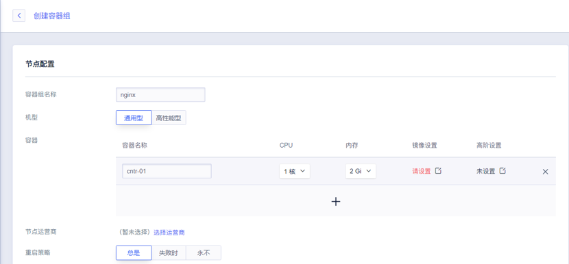
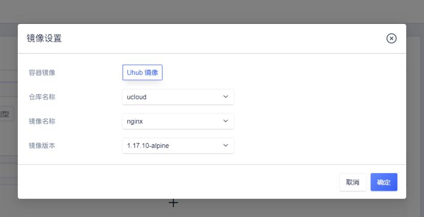
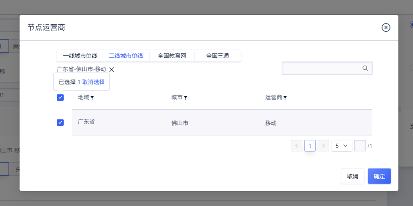
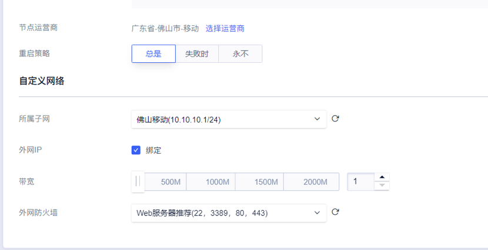

# 快速创建

### 使用须知

1. 您的业务程序需已经完成容器化，已有Docker镜像；

2. 容器组使用UCloud UHub镜像仓库，您需要创建并将镜像上传到镜像仓库；

3. 容器组服务的镜像拉取策略固定为总是（Always）

4. 请预先在需要部署容器组的边缘机房创建好子网

### 操作步骤

1.【创建容器组】

自定义容器组名称

2.【设置镜像】

选择一个仓库内的镜像，这里使用**ucloud**镜像仓库**nginx**镜像**1.17.10-alpine**版本，您也可以使用自有镜像，详情参考：[UHub镜像仓库操作](https://docs.ucloud.cn/uhub/guide)

3.【选择节点运营商】

选择您需要部署容器组的边缘机房

4.【设置网络】

选择子网，为容器组分配内网IP，若需要公网访问，可勾选绑定外网IP，并设置相应防火墙

5.【确认创建】

点击确认购买后，完成创建操作，在边缘机房拉取镜像，启动容器组后，即可通过公网IP访问该容器组

