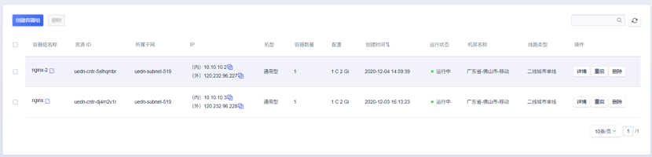
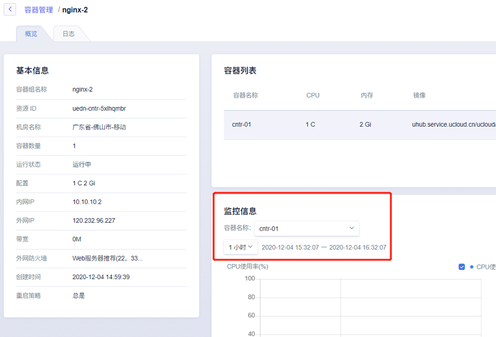

# 容器组管理

#### 容器管理页面

展示申请的所有容器组资源

列表信息包括：容器组名称、资源ID、所属子网、IP、机房、节点配置等信息。

操作：可对容器组进行删除、重启操作。

#### 详情

容器组管理列表中，点击详情按键，可进入容器组的详情页面

包括概览、容器列表、监控信息等；

###### 概览：包含容器组内外网IP、配置、状态等基础信息

###### 容器列表：包含容器配置基础信息等。

###### 监控信息：可按容器查看CPU使用率与内存使用率，同一容器组内的容器共享网络命名空间，网卡出入带宽与网卡出入包量以容器组维度统计

